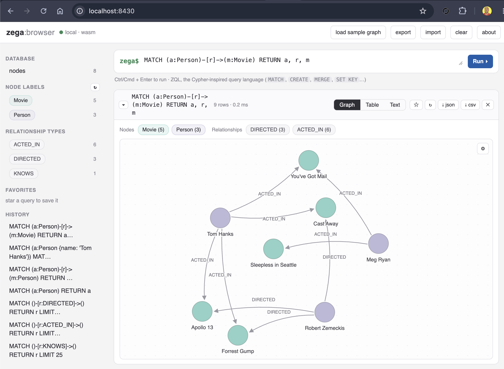
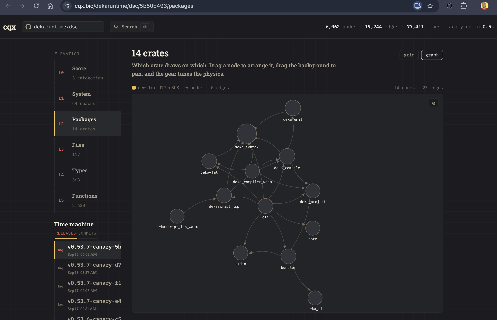

# zega

An embeddable graph database — with a KV store inside. Written in Rust.

<p align="left">
  
</p>

zega gives you what Neo4j gives you (a property graph with a Cypher-inspired
query language) and what Redis gives you (strings, lists, TTLs, atomic
counters) in one engine, one binary, one dependency. It runs in-process in
any Rust application, persists through a write-ahead log with snapshots, and
compiles to WebAssembly for the browser.

No separate database server to install unless you want one. The server is a
single binary that speaks HTTP/JSON. But you can absolutely run it in the browser, 
just like [cqx](https://cqx.bio) does for running queries without a server:

<p align="left">
  
</p>

## Features

- **Property graph** — labelled nodes, typed relationships, property indexes,
  and variable-length traversals (`-[*1..3]->`).
- **ZQL** — a Cypher-inspired query language: `MATCH`, `CREATE`, `MERGE`,
  `SET`, `DELETE`/`DETACH DELETE`, `WHERE`, `WITH`, `UNWIND`, `FOREACH`,
  `ORDER BY`/`SKIP`/`LIMIT`, aggregates (`count`, `sum`, `avg`, `min`, `max`,
  `collect`), `CASE`, and scalar functions.
- **KV store** — `GET`/`SET`/`DEL`/`INCR`, list operations (`LPUSH`/`RPUSH`/
  `LRANGE`/`LTRIM`), TTLs, and cursor-based `SCAN` — through the same query
  language or the same handle.
- **Embeddable** — `zega-core` is a library first. Open a database with two
  lines of Rust and run graph and KV queries against it.
- **WebAssembly** — `zega-wasm` exposes the same engine to JavaScript,
  in-memory, in the browser.
- **Durable** — CRC32-framed write-ahead log with group commit, torn-write
  detection, snapshots, and automatic WAL replay on open.
- **Optional server** — a tokio/axum HTTP server with token auth and
  read/write lock classification.
- **JWT auth + policy engine** — HS256/RS256 token verification and row-level
  access control when you need multi-tenant semantics.

## Run the server

The server binary is `zega-server`. It needs a data directory and a bearer
token:

```bash
ZEGA_DATA=./data ZEGA_SERVER_TOKEN=change-me cargo run --release -p zega-server
```

| Variable | Required | Default | Purpose |
|---|---|---|---|
| `ZEGA_DATA` | yes | — | directory for `wal.bin` and `snapshot.bin` |
| `ZEGA_SERVER_TOKEN` | yes | — | bearer token for every route |
| `ZEGA_SERVER_ADDR` | no | `127.0.0.1:7700` | listen address |
| `ZEGA_SERVER_WORKERS` | no | number of CPUs | worker threads |

### Run a query over HTTP

`POST /cql` executes a ZQL query. Reads and writes are classified
automatically and take the appropriate lock:

```bash
curl -s http://127.0.0.1:7700/cql \
  -H "Authorization: Bearer change-me" \
  -H "Content-Type: application/json" \
  -d '{
    "query": "CREATE (n:Person {name: $name}) RETURN n",
    "params": {"name": "Ada"}
  }'
```

```json
{"count": 1, "ok": true, "rows": [{"n": {"id": 1, "labels": ["Person"], "name": "Ada"}}]}
```

```bash
curl -s http://127.0.0.1:7700/cql \
  -H "Authorization: Bearer change-me" \
  -H "Content-Type: application/json" \
  -d '{"query": "MATCH (n:Person) RETURN n.name AS name"}'
```

### KV over HTTP

`POST /kv` takes an `op`, a `key`, and op-specific fields:

```bash
# set a key
curl -s http://127.0.0.1:7700/kv \
  -H "Authorization: Bearer change-me" -H "Content-Type: application/json" \
  -d '{"op": "set", "key": "greeting", "value": "hello"}'

# set only if absent (useful for claims/locks)
curl -s http://127.0.0.1:7700/kv \
  -H "Authorization: Bearer change-me" -H "Content-Type: application/json" \
  -d '{"op": "set", "key": "claim", "value": 1, "nx": true}'

# read it back
curl -s http://127.0.0.1:7700/kv \
  -H "Authorization: Bearer change-me" -H "Content-Type: application/json" \
  -d '{"op": "get", "key": "greeting"}'

# lists
curl -s http://127.0.0.1:7700/kv \
  -H "Authorization: Bearer change-me" -H "Content-Type: application/json" \
  -d '{"op": "lpush", "key": "items", "value": 42}'
```

Supported ops — reads: `get`, `lrange`, `ttl`, `exists`, `scan`; writes:
`set`, `del`, `incr`, `lpush`, `rpush`, `ltrim`, `expire`, `incr_with_ttl`.

KV operations are also part of ZQL itself:

```text
SET KEY session = $token TTL 3600
GET KEY session
INCR KEY hits
DEL KEY session
```

## Use it as a library

Add `zega-core` to your `Cargo.toml` (path or git dependency for now):

```rust
use std::collections::HashMap;
use zega_core::{Zega, Value};

// on-disk (wal.bin + snapshot.bin live in ./data)
let zega = Zega::open("./data").build()?;

// or purely in-memory
let zega = Zega::in_memory().build()?;

let mut params = HashMap::new();
params.insert("name".to_string(), Value::String("Alice".to_string()));

zega.query("CREATE (n:Person {name: $name})", params.clone())?;

let rows = zega.query("MATCH (n:Person {name: $name}) RETURN n", params)?;
assert_eq!(rows.len(), 1);

// the KV store is on the same handle
zega.kv_set("greeting".to_string(), Value::String("hello".to_string()), None)?;
zega.kv_incr("hits")?;
```

Durability is configurable on the builder:

```rust
let zega = Zega::open("./data")
    .wal_flush_every_write()   // fsync every append
    .wal_flush_interval(10)    // or group-commit every 10 ms
    .traversal_work_budget(1_000_000)
    .build()?;
```

## Use it in the browser

`zega-wasm` wraps an in-memory database for JavaScript via wasm-bindgen:

```bash
cd zega-wasm
wasm-pack build --target web
```

```javascript
import init, { ZegaWasm } from "./pkg/zega_wasm.js";

await init();
const db = new ZegaWasm();

db.query(
  "CREATE (n:Person {name: $name})",
  JSON.stringify({ name: "Ada" })
);

const rows = db.query(
  "MATCH (n:Person {name: $name}) RETURN n",
  JSON.stringify({ name: "Ada" })
);
console.log(JSON.parse(rows));

db.kv_set("greeting", JSON.stringify("hello"), null);
```

## The query language

ZQL looks like Cypher and behaves like it. A few real queries:

```text
// create
CREATE (n:User:Agent {email: $e})

// match with predicate, aggregate, order, page
MATCH (u:User)-[:PLACED]->(o:Order)
RETURN u.id, count(o) AS orders, sum(o.total) AS revenue
ORDER BY revenue DESC LIMIT 20

// variable-length traversal (subcategories up to 4 deep)
MATCH (c:Category {id: $cid})-[:SUBCATEGORY*1..4]->(sub:Category)
RETURN sub.id

// recommendations: co-purchased products
MATCH (pr:Product {id:$pid})<-[:CONTAINS]-(o:Order)-[:CONTAINS]->(rec:Product)
RETURN rec.id, count(*) AS freq
ORDER BY freq DESC LIMIT 10

// merge with defaults (upsert)
MERGE (u:User {email: $e})
ON CREATE SET u.password = $p, u.created = datetime()
ON MATCH SET u.password = coalesce(u.password, $p)

// detach delete
MATCH (s:Shop {id: $s}) DETACH DELETE s
```

Other supported pieces: `OPTIONAL MATCH`, `STARTS WITH`/`ENDS WITH`/
`CONTAINS`, `IS NULL`, string/math functions (`toLower`, `replace`, `split`,
`substring`, `size`…), `datetime()`, `timestamp()`, `duration({hours: 1})`,
`DISTINCT`, `CASE`, `FOREACH`, `UNWIND`, and `//` line comments.

## How persistence works

Every write is appended to a CRC32-framed WAL (`wal.bin`) — with group
commit by default (5 ms / 64-entry batches) or fsync-per-write if you ask
for it. Torn writes and bad checksums are detected and truncated on replay.
`Zega::snapshot()` writes a full `snapshot.bin`; the next open restores the
snapshot and replays only the WAL after it. Legacy WAL versions are migrated
automatically.

## Benchmarks

`zega-bench` runs the same workloads against zega (embedded), Redis (RESP),
and Neo4j (Bolt) side by side, and `commerce-bench` runs a commerce-shaped
graph (10k users, 5k products, 50k orders):

```bash
cargo run --release -p zega-bench -- zega
cargo run --release -p zega-bench -- redis   # needs redis on localhost:6379
cargo run --release -p zega-bench -- neo4j   # needs neo4j on localhost:7687
cargo run --release -p zega-bench --bin commerce-bench
```

## Workspace layout

| Crate | What it is |
|---|---|
| `zega-core` | the database: query execution, planner, JWT, policies, snapshots |
| `zega-graph` | property graph with label/property indexes and adjacency lists |
| `zega-kv` | the KV store: TTLs, lists, pub/sub, snapshot/restore |
| `zega-parser` | lexer + parser for ZQL |
| `zega-wal` | the write-ahead log: framing, group commit, replay, migration |
| `zega-server` | the optional HTTP server binary |
| `zega-wasm` | wasm-bindgen wrapper for the browser (in-memory) |
| `zega-bench` | benchmarks against Redis and Neo4j |

## Status

zega is early (0.1.0). The engine, query language, WAL, server, and wasm
wrapper are functional and tested; the wire protocol is HTTP/JSON only (no
Bolt compatibility yet), and there is no REPL.

## License

Apache-2.0. See [LICENSE](LICENSE).
